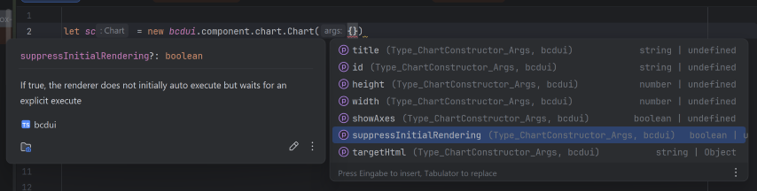
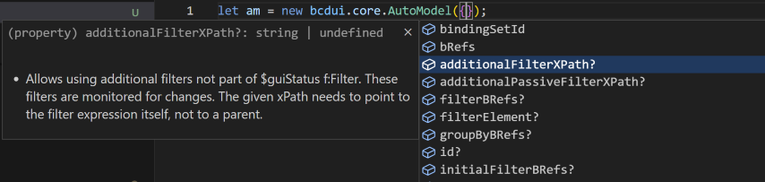
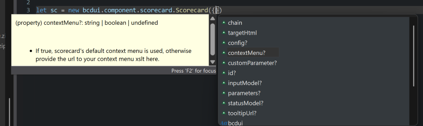

# BCD-UI JavaScript API stubs <span style="font-size: 0.6em; font-weight: normal">5.7.0 (2026-03-11)</span>

This folder contains stubs for the BCD-UI JavaScript API.
These can be used for auto-suggest in your IDE like VisualStudioCode, IntelliJ IDEA and Eclipse.

## Installation

Getting IDE support is as easy as making the readily provided TypeScript types files available in your workspace.

### Using NPM

Add

````json
{
  "devDependencies": {
    "bcdui": "https://github.com/businesscode/BCD-UI-Docu/raw/refs/heads/master/resources/bcduiTsTypes-5.7.0.tgz"
  }
}
````

to your `package.json` and run `npm install`.

This is already enough for Eclipse, IntelliJ IDEA and Visual Studio Code.

- Eclipse also needs tsconfig.json for WWD to start the Language Server. Typically it looks like this:

````json
{
  "compilerOptions": {
    "allowJs": true,
    "checkJs": true,
    "typeRoots": [
      "./node_modules/@types",
      "./node_modules"
    ],
    "types": ["bcdui"],
    "noEmit": true
    
  },
  "include": ["./WebContent/**/*.js"],
  "exclude": ["node_modules", "WebContent/WEB-INF"]
}
````
Adjust `WebContent` to point to your web resources and remove `"noEmit": true` for TypeScript projects.

This file also works for IDEA and VSC, but is not required.


### Manually

If you are not using `npm`, you can also just manually extract the bcduiTsTypes .tgz into `/node_modules/@types`.
- Make sure to use the bcduiTsTypes file, not bcduiApiStubs;
- Note, IntelliJ IDEA still needs `package.json` with the entry above to pickup the files for smart-completion even if manually installed.

## Screenshots

- IDEA Smart-Completion

  

- VSC IntelliSense

  

- Eclipse Content Assist

  
