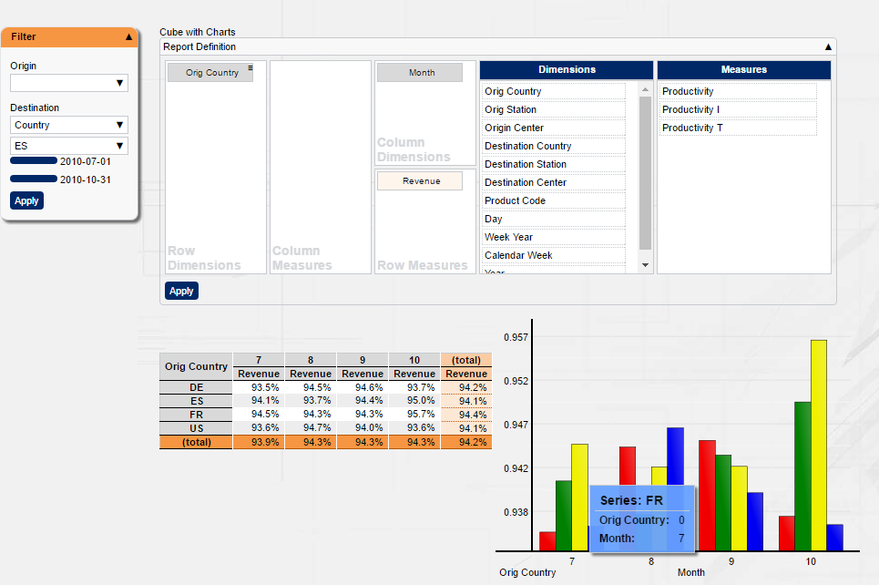

[[DocAbout]]
== About BCD-UI 5

=== Overview

BCD-UI 5 is a full-stack framework for building rich enterprise web applications.
It bases on HTML5 and Java technologies and provides many artifacts typically needed in such environments.

BCD-UI can be used in any regular Java Jakarta EE application with at least web profile, for example a Tomcat is enough. Developers who today already deliver or plan to deliver such applications and find it hard to develop all functionality with only jQuery, React or Angular, will profit from using BCD-UI.

Some of BCD-UI's features are:

* Configurable server side <<DocBinding,database access>> and data exchange via ready-to-use <<DocXmlData,web services>>
* Client-side <<DocCoreArtifacts,models>>, called DataProviders for retrieving, <<DocXsltLibrary,working>> with and displaying data
* Several elaborated <<DocWidgets,widgets>> needed in enterprise environments with two-way bindings to the data models
* Ready-to-use components like <<DocCube,pivot reports>>, <<DocCharts,charts>>, <<DocScorecard,scorecards>>, smart data uploading and editable data grids to name some
* Export of <<DocExports,WYSIWYG and detail data>>
* Infrastructure for <<DocI18n,internationalization>>, <<DocSecurity,security>>, <<DocThemes,theming>>, page lifecycle

and many more, as you will learn in this tutorial.

Assume you want to provide the user with the option of setting up a report
by defining dimensions and measures and filter data by time and location like this:

You will be surprised how easy you achieve this with BCD-UI. +
And going further and tweak the application to your needs is where BCD-UI continues supporting you,
so you can provide solutions with higher complexity with less effort, fewer bugs and less performance issues than ever.

With BCD-UI you are free to extend in any direction needed using standard technologies.
While you are not at all limited to BCD-UI components, you will often find an 80% solution already provided ready-to-use.

=== What about jQuery or Angular?

Good question, should you not rather use jQuery?
In fact, when using BCD-UI you will be using jQuery a lot directly and indirectly as BCD-UI itself is built with the help of jQuery and understands jQuery objects. +
And while not using Angular directly, BCD-UI uses _web-components_, which is also the basis for Angular modules,
and you will find the basic approach of Angular when dealing with data the on client and building reusable modules is very similar.

Yet, both libraries, like many others, limit themselves to somewhat low-level development and client side topics. +
jQuery thankfully provides an API, which should have been part of the browser already, plus a rich set of UI-widgets.
Angular brought architecture to a JavaScript client, where before many solutions tried without.
Both aspects are very important for enterprise applications and both are also part of BCD-UI.

But in the end, they do not provide you with database access, components on higher abstraction levels,
security or ready-to-use components and leave these complex parts for you to be solved. +
Still, BCD-UI combines freely with of today's standard libraries, as is itself comprised of standard technologies easy to integrate with everything else.

=== Is there commercial support?

Commercial support for BCD-UI if necessary can be provided by http://www.business-code.de[BusinessCode GmbH^], an independent software vendor in Germany.
We already delivered literally hundreds of solutions based on different versions of BCD-UI,
ranging from temporary installations to cover transitions up to a number of large scale installations
with over 10.000 distinct users for enterprise-critical scenarios.
There is even a BCD-UI Enterprise Edition: BCD-UI-EE available, providing even more features and full life-cycle support.
In most cases we think though the Community Edition available on GitHub and described here is fully supporting you use case.
