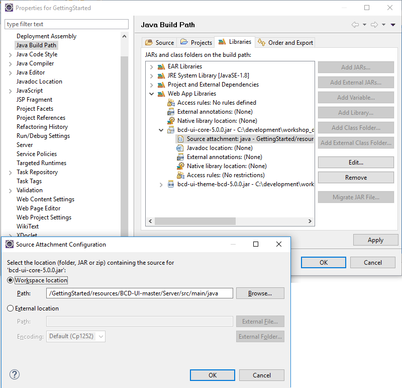

[[DocAppsetup]]
== Application Setup

A BCD-UI application is a regular Jakarta EE application. These steps are show how to add BCD-UI to an existing web application project.

There are many good tutorials for each IDE on how to set up a web application, for Eclipse you could follow https://medium.com/@zandra.harner/setting-up-the-develop-environment-for-lop-a-web-application-in-eclipse-ide-7f3a36eddf60[this] one on Medium.

We suggest to, before adding BCD-UI to it, test your web application without BCD-UI. Open a page, maybe call a test Servlet. If your application runs without BCD-UI then it will also run with BCD-UI.

=== Adding BCD-UI

. Add BCD-UI jars +
See https://github.com/businesscode/maven-repo for maven and gradle.
+
.For example for gradle add
[source,gradle]
----
dependencies {
  repositories {
    mavenCentral()
    maven {
      url "https://github.com/businesscode/maven-repo/raw/master"
    }
    implementation 'de.businesscode.bcdui:bcd-ui-core:5.5.0-SNAPSHOT'
    implementation 'de.businesscode.bcdui:bcd-ui-theme-bcd:5.5.0-SNAPSHOT'
  }
}
----
If you prefer you may also download the BCD-UI's jars, and their dependencies mentioned in https://github.com/businesscode/BCD-UI/blob/master/Docu/development/bcdui_dependencies.gradle[BCD-UI/Docu/development/bcdui_dependencies.gradle] and put them into WEB-INF/lib. +
+
NOTE: These two jars not only hold all Java classes for the server but also all client side sources of BCD-UI like JavaScript and XSLT. BCD-UI makes sure they are served to the client along with your client side sources which are placed were you would usually place them.

. Add Entries to web.xml +
To register BCD-UI's servlets and filters, add the entries from link:https://github.com/businesscode/BCD-UI/blob/master/Server/configFiles/web.xml[BCD-UI/Server/configFiles/web.xml, window="_blank"] to your web.xml. +
When you upgrade to a new version of BCD-UI check in https://github.com/businesscode/BCD-UI/blob/master/Docu/releaseNotes.adoc[release notes] whether it changed.

. Create an empty WEB-INF/bcdui/bindings +
All configuration files for BCD-UI are located at WEB-INF/bcdui. Create an empty `WEB-INF/bcdui/bindings` folder, later you'll add <<DocBinding,Bindings>> here.

. Add logging configuration +
Copy link:https://github.com/businesscode/BCD-UI/blob/master/Server/configFiles/log4j2.xml[BCD-UI/Server/configFiles/log4j2.xml, window="_blank"]
to your project's src/main/resources folder.

. Add entries for the database +
See link:https://github.com/businesscode/BCD-UI/blob/master/Server/configFiles/tomcat/context.xml[context.xml] for entries for several databases for Tomcat. +
The jndi entry
+
[source,xml]
----
 <Environment name="bcdui/defaultConnection" type="java.lang.String" value="jdbc/connectionXX"/>
----
is important as it denotes the connection used of none is explicitly given in a BindingSet.

////
TODO
==== Optionally

Add BCD-UI Java sources::
For debugging of server components it might be helpful to add the java sources of BCD-UI to the eclipse workspace.
The easiest way is to download or git-clone the BCD-UI project from github to an extra folder outside of your workspace.
Then configure the source location via menu:Right-Click-Project(Build Path>Configure Build Path), by selecting bcdui-core.jar
and assign `Server/src/main/java` of the download location as source attachment.

////

=== BCD-UI folder layout

BCD-UI follows standard Java Web Application layout. +
One thing less common though is that the JavaScript and other static sources come with the 2 BCD-UI jars mentioned. So they are in these jars in WEB-INF/lib and not in your web content folder next to WEB-INF. +
StaticResourceServlet of BCD-UI assures that for the client it looks as if they were there though.

[cols="1 m,1 m,1 m,1 m,2 m,5"]
|===
2+|Project/||| s|Eclipse project
||src/main/||| s|
|||java/|| s|Project java sources
|||resources/ 2+|log4j.properties s|Logging settings
| 2+|WebContent/|| s|Webapp itself
|||...|| s|Project's HTML pages, JavaScript etc
|||bcdui/|| s|BCD-UI's virtual main folder, blended here by a Servlet
||||js/| s|JS library mapped from bcd-ui-core.jar
||||xslt/| s|XSLT library mapped from bcd-ui-core.jar
||||theme/| s|Themes library mapped from bcd-ui-theme.jar
||||servlets/| s|BCD-UI's servlets are mapped here
|| 2+|WEB-INF/||
||||bcdui/| s|Configuration for BCD-UI
|||||bindings/ s|Project's BCD-UI BindingSets are put here
||||lib/||
|||||... s|3rd party and project libs
|||||bcd-ui-core.jar s|Java classes and static sources (js,xslt) mapped to /bcdui
|||||bcd-ui-theme.jar s|Themes, mapped to /bcdui/theme at runtime
||||web.xml| s|Contains some BCD-UI library related entries
|| 3+|META-INF/context.xml s|Containing JDBC database connections
|===
