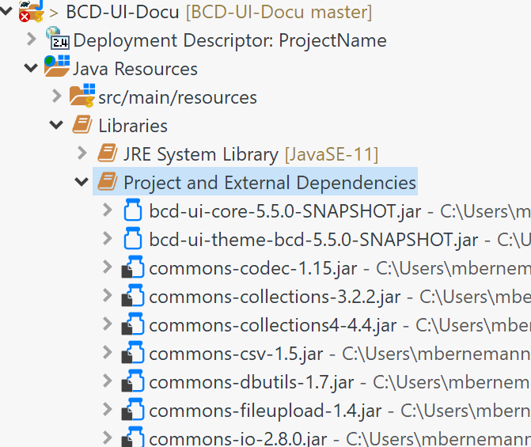

[[DocAppsetup]]
== Application Setup

A BCD-UI application is a regular Jakarta EE application. These steps are show how to add BCD-UI to an existing web application project.

There are many good tutorials for each IDE on how to set up such a web application. For Eclipse, you could follow link:https://medium.com/@zandra.harner/setting-up-the-develop-environment-for-lop-a-web-application-in-eclipse-ide-7f3a36eddf60[this^] one on Medium.

[IMPORTANT]
Before adding BCD-UI to your project, make sure you test your plain web application. Open a page, call a test Servlet, all without BCD-UI. You should be familiar with running a web application without BCD-UI as it is the bases for BCD-UI.

=== Adding BCD-UI

. Add BCD-UI jars +
In this tutorial we use link:https://docs.gradle.org/current/userguide/userguide.html[Gradle^] build tool for defining dependencies. Don't be afraid, you do not need to know much about Gradle to follow this tutorial. +
Eclipse (__Buildship__ plugin installed per default) and IDEA support gradle out of the box. For Visual Studio Code, add the __Gradle__ extension. +
+
Add a `build.gradle` file as shown here link:https://github.com/businesscode/maven-repo[window="_blank"] to your project root.
+
When working with Eclipse, open menu:File[Import...|Existing Gradle Project] and select your project root, if your project is already in Eclipse Workspace, then add "Gradle Nature" to the project and trigger "Gradle-Refresh".
+
TIP: we refer to `webAppDirName = "WebContent"` as the content directory in the gradle file, please ensure it matches your web module configuration.
+
It worked when you see BCD and all of its dependencies under `Project and External Dependencies`.
+

+
TIP: These two jars not only hold all Java classes for the server but also all client side sources of BCD-UI like JavaScript and XSLT. BCD-UI has a Servlet that makes sure they are served to the client along with your client side sources, which are placed were you would usually place them.
+
If you prefer to go without Gradle, you may also manually download the BCD-UI's jars, and their dependencies mentioned in link:https://github.com/businesscode/BCD-UI/blob/master/Docu/development/bcdui_dependencies.gradle[BCD-UI/Docu/development/bcdui_dependencies.gradle^] and put them into WEB-INF/lib. But this is not recommended.
+

. Add Entries to web.xml +
To register BCD-UI's servlets and filters, add the entries from link:https://github.com/businesscode/BCD-UI/blob/master/Server/configFiles/WebContent/WEB-INF/web.xml[BCD-UI/Server/configFiles/WebContent/WEB-INF/web.xml^] to your web.xml. +
Now comment out the <filter> bcdui4.ShiroFilter including its <filter-mapping>. Otherwise, you will be redirected to a login.htm page, which you do not have yet. +
When you upgrade to a new version of BCD-UI check in link:https://github.com/businesscode/BCD-UI/blob/master/Docu/releaseNotes.adoc[release notes^] whether it changed.

. Create an empty WEB-INF/bcdui/bindings +
All configuration files for BCD-UI are located at WEB-INF/bcdui. Create an empty `WEB-INF/bcdui/bindings` folder, later you'll add <<DocBinding,Bindings>> here.

. Add logging configuration +
Copy link:https://github.com/businesscode/BCD-UI/blob/master/Server/configFiles/src/log4j2_debug_.xml[BCD-UI/Server/configFiles/log4j2_debug_.xml^]
to your project's `src/main/resources` folder and rename it to log4j2.xml.

. Copy link:https://github.com/businesscode/BCD-UI/blob/master/Server/configFiles/WebContent/WEB-INF/bcdui/subjectSettings.xml[BCD-UI/Server/configFiles/subjectSettings.xml^] to `WEB-INF/bcdui`

. Add entries for the database +
See link:https://github.com/businesscode/BCD-UI/blob/master/Server/configFiles/tomcat/context.xml[context.xml^] for entries for several databases for Tomcat. +
The jndi entry
+
[source,xml]
----
 <Environment name="bcdui/defaultConnection" type="java.lang.String" value="jdbc/connectionXX"/>
----
is important as it denotes the connection used of none is explicitly given in a BindingSet.

. Unzip bcduiApiStubs.zip at link:https://github.com/businesscode/BCD-UI-Docu/tree/master/resources[^] into `WebContent/bcdui/dev/`. +
This file can be used for autocompletion of BCD-UI JavaScript classes in the editor by using
+
----
During runtime when, served by the server, this `import` is automatically removed from the JavaScript files and the real API and the implementation is read from bcdui-core.jar.

////
TODO
==== Optionally

Add BCD-UI Java sources::
For debugging of server components it might be helpful to add the java sources of BCD-UI to the eclipse workspace.
The easiest way is to download or git-clone the BCD-UI project from GitHub to an extra folder outside your workspace.
Then configure the source location via menu:Right-Click-Project(Build Path>Configure Build Path), by selecting bcdui-core.jar
and assign `Server/src/main/java` of the download location as source attachment.

image::images/appsetup_addSources.png[]
////

=== BCD-UI folder layout

BCD-UI follows standard Java Web Application layout.

IMPORTANT: One thing less common though is that the JavaScript and other static sources come with the 2 BCD-UI jars mentioned. So they are in these jars which itself is in `WEB-INF/lib`. As you know, usually the browser cannot request any content from `WEB-INF/` directly, for example a css file. But BCD-UI's built-in StaticResourceServlet serves these files from the jar at the virtual folders `/bcdui/js`, `/bcdui/xslt` etc.

Take a moment to understand the structure and what to expect physically in Eclipse (*strong font*) and what parts are only virtually there, once deployed (__italic font__).

[grid=rows]
[cols=" m,2 m,2 m,2 m,4 m,10"]
|===
4+|Project/||
| 2+|build.gradle|| s|Taking care for jars below link:https://github.com/businesscode/maven-repo[template^]
||src/main/||| s|Project's server side resources
|||java/|| s|Project java sources
|| 3+|resources/ s|Project's static server side resources
||| 2+|log4j2.xml s|Logging settings link:https://github.com/businesscode/BCD-UI/blob/master/Server/configFiles/src/log4j2_debug_.xml[template^]
| 2+|WebContent/|| s|Webapp itself
|||...|| s|Project's HTML pages, JavaScript etc
|||bcdui/|| e|BCD-UI's virtual main folder for client resources, blended here by a Servlet:
||||js/| e|JavaScript library mapped from bcd-ui-core.jar
||||xslt/| e|XSLT library mapped from bcd-ui-core.jar
||||theme/| e|Themes library mapped from bcd-ui-theme.jar
||| 2+|servlets/ e|BCD-UI's servlets are mapped here
|| 2+|WEB-INF/||
||||bcdui/| s|Configuration for BCD-UI
|||||bindings/ s|Project's BCD-UI <<DocBinding,BindingSets>> are put here
||||lib/| e|Gradle virtually puts the content here:
|||||... e|3rd party and project libs
|||||bcd-ui-core.jar e|Java classes and static sources (js,xslt) virtually mapped to and served to the client from `/bcdui/` at runtime
|||||bcd-ui-theme.jar e|Themes, mapped to /bcdui/theme at runtime
||||web.xml| s|Contains some BCD-UI library related entries link:https://github.com/businesscode/BCD-UI/blob/master/Server/configFiles/WebContent/WEB-INF/web.xml[template^]
|| 2+|META-INF/||
||| 2+|context.xml s|Contains JDBC database connections link:https://github.com/businesscode/BCD-UI/blob/master/Server/configFiles/tomcat/context.xml[template^]
|===

This tutorial itself is built around a fully functional BCD-UI application, which you inspect here link:https://github.com/businesscode/BCD-UI-Docu[window=_blank].