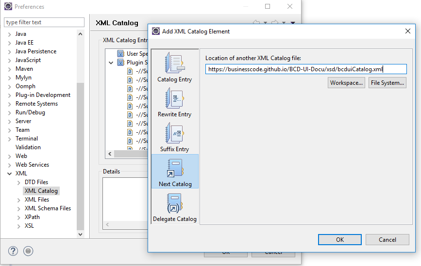
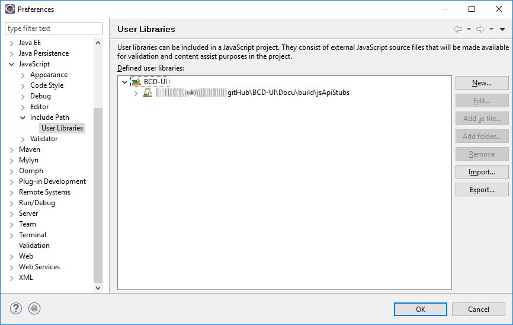
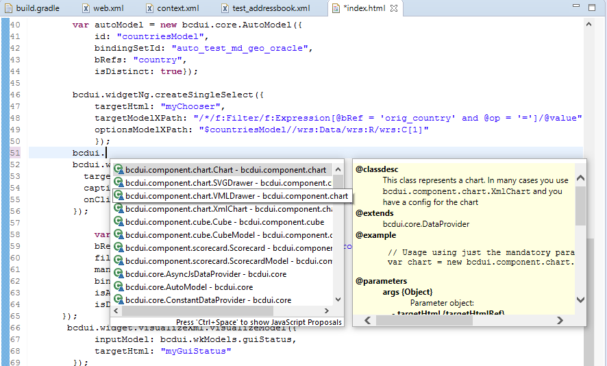
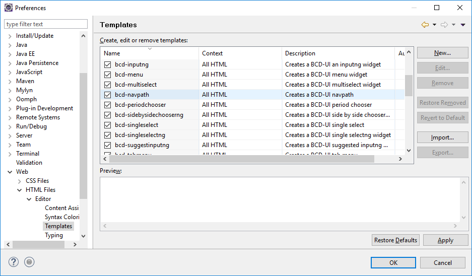
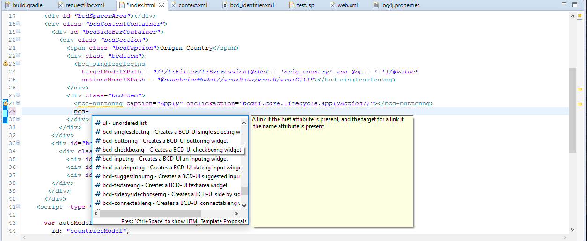

[[DocBootstrap]]
== Bootstrap

This helps to set up your development environment for BCD-UI.

=== Getting the tools

To start development with BCD-UI, first get the tools:

* Make sure you have JDK 11 or higher
* Install an IDE of your preference, we assume Eclipse in our samples.
* Install a Jakarta EE web server like Oracle WebLogic, IBM Websphere or JBoss, we assume Tomcat 8.5or 9 in our examples

[TIP]
====
If you are not already familiar with the concept if of Java Web Applications, you find many good tutorials. Here are some very short for Eclipse as Servlet in a Tomcat-combination:

. Install link:https://www.eclipse.org/downloads/packages/[Eclipse IDE for Enterprise Java and Web Developers^] and Java JDK from link:https://developers.redhat.com/products/openjdk/download[Red Hat^] with an account or link:https://aws.amazon.com/corretto[Amazon AWS^] without an account
. Baeldung on link:https://www.baeldung.com/tomcat[installing Tomcat^] and on link:https://www.baeldung.com/eclipse-tomcat[connecting Eclipse with Tomcat^]
. Minimal sample creating a Java Servlet and a JQuery Ajax call link:https://programming.vip/docs/servlet-processing-jquery-ajax-requests.html[tutorial^]. +
You won't have to develop Servlets when start using BCD-UI as it comes with Servlets and also, while BCD-UI uses jQuery internally, you may not need to use it directly. But an understanding of these technologies is definitely recommended.
====

==== Tomcat compress resources
For performance reasons, you should allow compression for static resources. +
For Tomcat adjust in server.xml,
see link:https://github.com/businesscode/BCD-UI/blob/master/Server/configFiles/tomcat/server.xml[BCD-UI/Server/configFiles/tomcat/server.xml^]

==== XML schema xsd catalog

Adding the XML schema catalog of BCD-UI to your workspace will support you in creating XML configuration files for BCD-UI
by linking to link:https://businesscode.github.io/BCD-UI-Docu/xsd/bcduiCatalog.xml[window=_blank]

For Tomcat, follow these steps:

menu:File[Window > Preferences > XML > XML Catalog > Add... > Next Catalog]

will bring you:

image::images/bootstrap_xmlSupport.png[]

TIP: You refresh them with the "Reload Entries" feature in Eclipse. Keep in mind that online they always reflect the latest XML schemas, independent of the version of BCD-UI you are using.

==== JavaScript Api stubs

BCD-UI provides a file with its JavaScript API. Add this to your IDE, and you will have auto-complete while editing JavaScript. The file can be found here: link:https://businesscode.github.io/BCD-UI-Docu/resources/bcduiApiStubs.js[^]. +

Use the standard ECMA 6 mechanism to make them known in a file.
[source,javascript]
import {bcdui} from "./bcdui/dev/bcduiApiStubs.js";

will bring you, code completion and help tooltips while hovering with your mouse:

IMPORTANT: The real usage of BCD-UI implementation is not done with `import`. This `import` of the stubs is removed by BCD-UI automatically when the JavaScript file is served to the client. Its only purpose is making the API available to the editor. +
At runtime the implementation is served from bcd-ui-core.jar. As you will see, that is loaded with
[source,javascript]

////

==== HTML 5 Custom Elements

All BCD-UI widgets, components and even core objects come with an HTML custom element API. This is especially useful for visible objects. To make for example the Eclipse editor aware of these, import `https://businesscode.github.io/BCD-UI-Docu/xsd/bcduiCatalog.xml` at menu:Preferences[Web > HTML Files > Editor > Templates > Import...].
The elements should then appear in the template list.

While editing HTML files the templates popup can be opened with kbd:[CTRL+SPACE] and the list of BCD-UI elements should be found as shown here:

////