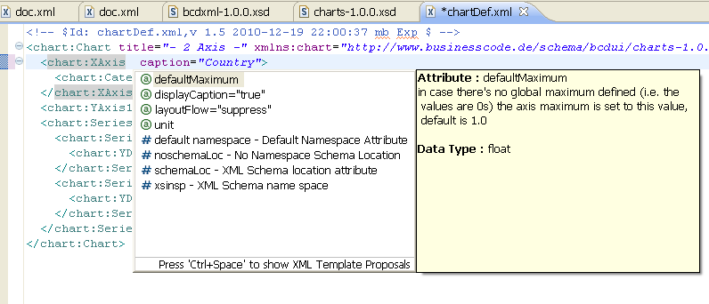

[[DocBootstrap]]
== Bootstrap

This chapter guides you through the steps of initially setting up your development environment for BCD-UI.

=== Get the tools

To start development with BCD-UI, first get the tools:

* Make sure you have JDK 11 or higher
* Install an IDE of your preference, we assume Eclipse in our samples.
* Install a Jakarta EE web server like Oracle WebLogic, IBM Websphere or JBoss, we assume Tomcat 8.5 in our examples

TIP: For performance reasons you should allow compression for static resources. +
For Tomcat adjust in server.xml,
see link:https://github.com/businesscode/BCD-UI/blob/master/Server/configFiles/tomcat/server.xml[BCD-UI/Server/configFiles/tomcat/server.xml, window="_blank"]

=== XML schema xsd catalog

Adding the XML schema catalog of BCD-UI to your workspace will support you in creating XML configuration files for BCD-UI
by linking to `https://businesscode.github.io/BCD-UI-Docu/xsd/bcduiCatalog.xml`

For Tomcat, follow these steps:

menu:File[Window > Preferences > XML > XML Catalog > Add... > Next Catalog]

image::images/bootstrap_xmlCatalog.png[]
will bring you:

////

TODO

==== JavaScript Api stubs

BCD-UI provides JavaScript API. Add these to your IDE and you will have auto-complete while editing JavaScript.
The JavaScript files can be obtained here: "ADD_LOCATION".
For Eclipse the stubs can be added via menu:Preferences[JavaScript > Include Path> User Library].
First add a new library 'BCD-UI' and then add the folder containing the stubs you downloaded. (Add Folder...)

image::images/bootstrap_addJsCodeCompletion.png[]
will bring you, code completion and help tooltips while hovering with your mouse:

image::images/bootstrap_jsCompletion.png[]

==== HTML 5 Custom Elements

All BCD-UI widgets, components and even core objects come with an HTML custom element API. This is especially usefull for visible objects. To make for example the Eclipse editor aware of these, import `https://businesscode.github.io/BCD-UI-Docu/xsd/bcduiCatalog.xml` at menu:Preferences[Web > HTML Files > Editor > Templates > Import...].
The elements should then appear in the template list.

image::images/bootstrap_htmlTemplates.png[]

While editing HTML files the templates popup can be opened with kbd:[CTRL+SPACE] and the list of BCD-UI elements should be found as shown here:

////