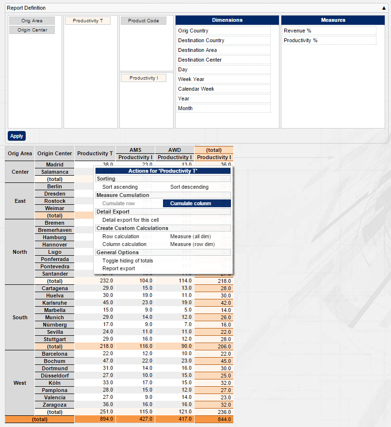

[[DocMinimalCube]]
== Minimal cube setup

In this section we will use one of BCD-UI's powerful components, the <<DocCube,Cube>>. +
Now that you already managed create your first page in the previous section,
we will also take the chance and explain things in more detail.

=== Overview

A _cube_ allows for slicing and dicing data by free dimensions easily and quickly in a pivot-like manner.
The following steps are necessary to create a report page: +

Define BindingSets for the logical data model:: To access the database, you define BindingSets as the application's logical view to the database.
Set up a page:: Load bcdui.js onto you HTML page and add the predefined divs needed by the theme
Add report filters to the page:: This allows you to define which data is taken into account for the report.
Add a cube component on the page:: This allows you to choose the dimensions and measures you want to see.

=== Step by step

==== Definition of the logical data model

BCD-UI uses BindingSets to access the underlying database.
A BindingSet defines the logical names and constraints, which apply when accessing the database. +
We start with the BindingSet for the country list. Add the following file to `WEB-INF/bcdui/bindings/myGeoData.xml`, adjusted o a table you have:

[source,xml]
----
include::../web/WEB-INF/bcdui/bindings/myGeoData.xml[]
----
<1> BindingSet root element namespace need to be correct
<2> `id` is the logical name within the application
<3> `table` is the physical name of the table or view it the database
<4> Each `bnd:C` is a _BindingItem_ represents an individual column, you give it a logical id, and you can enforce some attributes
<5> This is the column expression for the database, often simply the column name but in can also be something more complex like `substr(colname,2)`

BindingSets are located in `WEB-INF/bcdui/bindings` or  sub-folder and are evaluated by BCD-UI on start time.
Information like the data type can be given in the file, otherwise it is derived from the column's physical data type. But you can always overwrite this in the BindingSet if you need to.

To define a BindingSet for the table (or view) holding the data that shall be shown in a cube,
create a file `WEB-INF/bcdui/bindings/myReportData1.xml` and adjust the following content to your table and column names:

[source,xml]
----
include::../web/WEB-INF/bcdui/bindings/myReportData1.xml[tag=simple]
include::../web/WEB-INF/bcdui/bindings/myReportData1.xml[tag=closing]
----

==== Page setup

Add a page `WebContent/minimalCube/index.html` to your application.

[source,html]
----
include::../web/blankPage.html[]
----
<1> Load bcdui/bcdui.js, that's all.
<2> BCD-UI theme requires some HTML elements for the layout
<3> This area, _sidebar_, will hold our choosers, it is convenient for styling but not necessary for function
<4> This is the main page part of the theme
<5> Place any JavaScript code here

You should now be able to see a styled page if you navigate to it with the browser.
Otherwise, you probably missed adding bcdui.jar and the web.xml entries, <<DocGettingStarted,application setup>>.

==== Add a report filter

Report filters are widgets allowing the user to restrict data to be shown in a report.
Many filters show values to choose from based on reference data. +
The filter in this example uses a list of countries to choose from.
To add a model with the available data, add the following code to your script block at page bottom:

[source,javascript]
----
include::../web/minimalCube/index.html[tag=geoDataAutoModel]
----
<1> Id of the loaded data if referenced in an XPath via $geoData
<2> Id of the BindingSet used to retrieve the data
<3> Space separated ids of the BindingItems of the BindingSet

For the widget, if we create it via JavaScript, we need a place in HTML, where it should appear.
We will add 2 widgets: A country chooser and a button to re-run the report.

[source,html]
----
include::../web/minimalCube/index.html[tag=geoChooserTH]
----
<1> This is the container for the theme's _sidebar_
<2> This is where the country chooser goes

NOTE: The _sidebar_ is an extra area of the theme, often used for widgets.
BCD-UI theme helps to create such an area, but there is no technical need to use it, you may place choosers anywhere on your page.

Create the widgets:

[source,javascript]
----
include::../web/minimalCube/index.html[tag=geoDataSelect]
----
<1> `targetHtml` tells us where to place the widget.
<2> `targetModelXPath` defines where the output will be stored.
Note that this is an XPath and $guiStatus refers to a DataProvider with id 'guiStatus'.
<3> `optionsModelXPath` tells us where the values to select from come from
<4> `bcdui.core.lifecycle.applyAction` is a function that comes with BCD-UI for re-loading the page with the current guiStatus

.After page reload, you should see this
image::images/minimalCube_chooser.png[]

The chosen item will be stored in the guiStatus using the targetModelXPath's form and position.

NOTE: If a chooser uses f:Filter format for its output and places its output in guiStatus below `/guiStatus:Status/f:Filter`,
it is automatically picked up by the cube to limit the data retrieved from the server.

You can find more widgets <<DocWidgets,here>>.

==== Define the cube

By default, the cube uses a file called `cubeConfiguration.xml` in the same folder as your HTML page.
This configuration file holds the Cube's information about dimensions and measures and the source BindingSet. +
If your BindingItems are different, adjust them here.

[source,xml]
----
include::../web/minimalCube/cubeConfiguration.xml[]
----

Further options available for cubes are described <<DocCube,here>>.

We already prepared the HTML to contain a div with id `myData`, this is where we will show our cube's output. +
Add the following to the script at the page bottom:

[source,javascript]
----
include::../web/minimalCube/index.html[tag=newCube]
----

If you load the page for the first time, no data is displayed, because we did not yet tell the cube which one to show.
You can do this statically or let the user decide, we go for the second option and add a powerful user interface.

==== Add a cube's drag and drop area

To create a CubeConfigurator, add a file `dimensionsAndMeasures.xml` to your folder.
This one tells the CubConfigurator to just derive its content from dimensionsAndMeasures.xml.

[source,xml]
----
include::../web/minimalCube/dimensionsAndMeasures.xml[]
----

Add this to the JavaScript area to create the actual cube component:

[source,javascript]
----
include::../web/minimalCube/index.html[tag=newCubeConfigurator]
----

==== Testing the report

Congratulations, these were all steps required to  set up a reporting cube.
You can now test the report!

==== Where to go from here

* <<DocCoreArtifacts,BCD-UI core concepts>>
* <<DocExports,More about the Cube and export>>
* <<DocCharts,Charts>>
