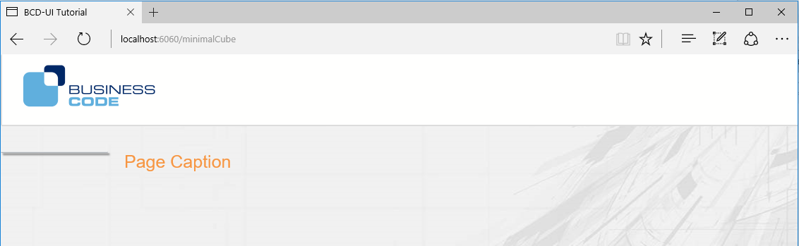
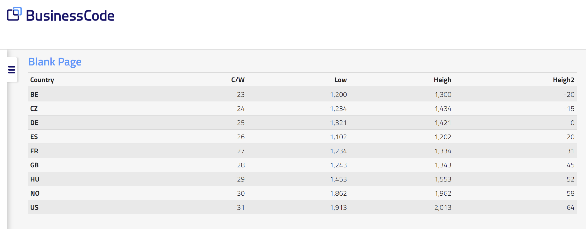
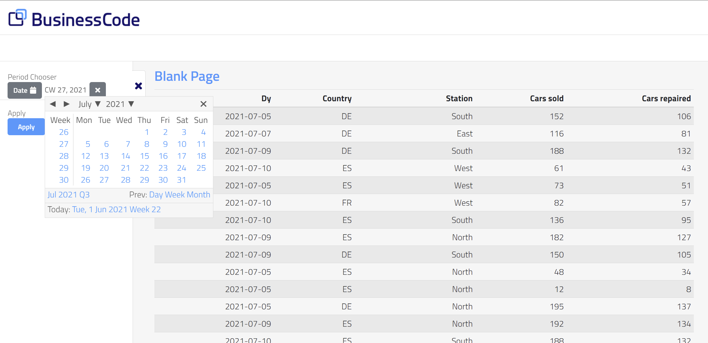
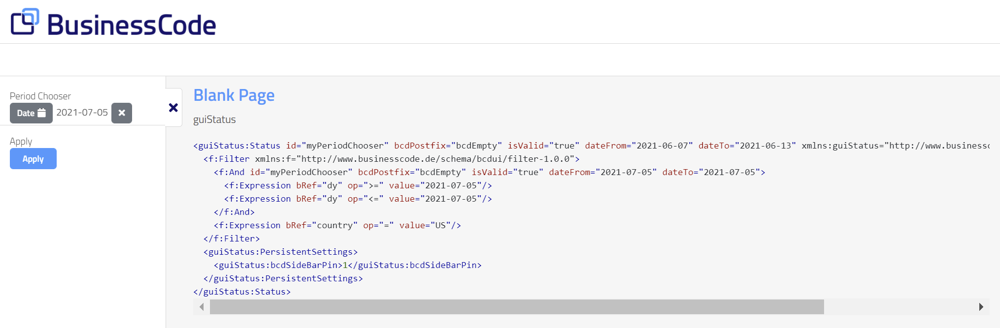
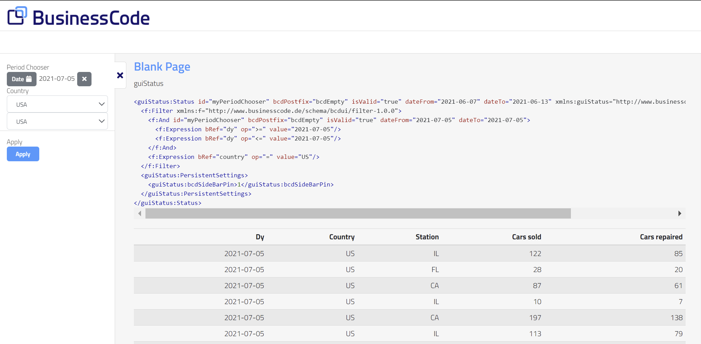

[[DocSimpleReq]]
== Your first BCD-UI page

In this section we create a small BCD-UI application and explain some core concepts. +

=== Overview

These are the steps of this section:

. Page Setup: Set an HTML frame for over-all layout
. Use a _SimpleModel_ to load static data from an XML file
. Add a _Renderer_ to transform data to HTML
. Use an _AutoModel_ to dynamically load data from the database
. Add a _PeriodChooser_ an apply button to reload the page with data of the selected date
. Use a _SingleSelect_ to further filter the data

=== Step by step

==== Set the page up

While you are totally free in your page layout, here makes sense to use BCD-UI's default layout as a start. +
Add WebContent/simpleReq/index.html with BCD-UI capability to your application and adjust the urls at the beginning from `./` to `../`

// tag::blankBcduiPage[]
.A blank BCD-UI page
[source,html,linenums,highlight='6,19-20,25-26,31']
----
include::../web/blankPage.html[]
----
<1> Loads BCD-UI library including theme
<2> Root of page structure of BCD-UI theme
<3> Menu will go here
<4> This we call 'SideBar', this is where we will later place the report filters
<5> Here we will place the data output and show the guiStatus' content
<6> Here we will display out output
<7> Any of your local JavaScript code goes here
// end::blankBcduiPage[]

Now we already have an empty but fully styled page, open it in a browser.

TIP: BCD-UI theme has 2 parts. +
The part that is responsible for the overall page layout and structure is shown here. Usage of this part is optional. You can also use your favorite page structure and css instead. +
The part that styles widgets and components is mandatory to style these artifacts.

==== Add static data

Add a file `staticData.xml` with the following content to the /simpleReq:

[source,xml]
----
include::../web/sampleWrs.xml[]
----

NOTE: Above XML is a sample of a BCD-UI's _WebRowSet_ format Wrs, which is used to transfer data. +
Many parts of BCD-UI understand this format and show smart behaviour if you use it also for static files.

Now add the following script block to end of the page:

.Load static data
[source,javascript]
var staticData = new bcdui.core.SimpleModel("staticData.xml");

A link:../jsdoc/bcdui.core.SimpleModel.html[bcdui.core.SimpleModel^] is used to load data from the server.
Like all models it is loaded lazy, so it is not loaded to the client until a displaying component requests it.

==== Add a Renderer

Create a link:../jsdoc/bcdui.core.Renderer.html[bcdui.core.Renderer^] to display the data.
A _Renderer_ expects a _DataProvider_ (our SimpleModel is a _DataProvider_) plus an HTML element id (targetHtml) where the show the output.

.A typical renderer created with JavaScript
[source,javascript]
var renderer = new bcdui.core.Renderer({
  inputModel: staticData,
  targetHtml: "myDataDiv"
});

NOTE: By default, the result is rendered as a plain table. You will often want to provide some other layout. To do this, you create a custom XSLTs JavaScript or doT.js file turning Wrs into HTML and provide it to the renderer.

The result is:

Congratulations, this is already your first BCD-UI page!

===== Use an HTML custom tag instead

You can also use a custom HTML tag to create a renderer. The advantage is that it goes right where it will appear. To do this, replace `

` with

.A typical renderer created with JavaScript
[source,html]
<bcd-renderer inputModel="staticData"></bcd-renderer>

While the JavaScript version above references the JavaScript variable `staticData` directly, the custom tag only knows the id of the input model. You register your DataProviders simply by giving them an `ìd`:
[source,javascript]
var staticData = new bcdui.core.SimpleModel({ id: "staticData", url: "staticData.xml" });

While the JavaScript variable, and the id are both `staticData` in this example, they are completely separate things and do not need to be identical.

==== Load data from database

Instead of reading the data from a static file, we will now access the database.

===== Connect to a database

<<DocBinding,BindingSets>> connect BCD-UI to your database. Each database access is mediated by a BindingSet. For the following you obviously need a database and some data. Please identify or create a table with some columns including a date column. Make sure to also have the right database driver in your java dependencies

Add the following as testData.xml to `WEB-INF/bcdui/bindings`, and adjust it to your table.

[source,xml]
----
<BindingSet xmlns="http://www.businesscode.de/schema/bcdui/bindings-1.0.0"
  id="carRepairs" table="car_repairs"> <!--1--> <!--2-->

  <C id="id" caption="Id" isKey="true"> <!--3-->
    <Column>id</Column> <!--4-->
  </C>
  <C id="dy" caption="Dy">
    <Column>dy</Column>
  </C>
  <C id="yr" caption="Year">
    <Column>EXTRACT( YEAR from dy)</Column> <!--5-->
  </C>
  <C id="country" caption="Country">
    <Column>country</Column>
  </C>
  <C id="station" caption="Station">
    <Column>station</Column>
  </C>
  <C id="carsSold" caption="Cars sold">
    <Column>cars_sold</Column>
  </C>
  <C id="carsRepaired" caption="Cars repaired">
    <Column>cars_repaired</Column>
  </C>
</BindingSet>
----
<1> `id`: The BindingSet's logical name in the application
<2> `table`: The real table name in your database
<3> A logical BindingItem name
<4> The real column name in you database
<5> You may also use a valid column expression here

===== Create an AutoModel

The following link:../jsdoc/bcdui.core.AutoModel.html[bcdui.core.AutoModel] sends a request referencing a _BindingSet_ and retrieves the listed _BindingItems_ from your data. +
The requested data can be filtered by country or by dy. We will add filters later.

Add this to the script block at the end of the page:

.For simple requests, AutoModels may be enough
[source,javascript]
----
var carRepairs = new bcdui.core.AutoModel({
  bRefs: "dy country station carsSold carsRepaired",
  filterBRefs: "country dy",
  bindingSetId: "carRepairs",
  isDistinct: true
});
----

To let the renderer show this data, change the renderer's parameter to `inputModel: carRepairs`. +

Reload the page: Now you are already using your database!

==== Add a PeriodChooser
In this section we add a link:../jsdoc/bcdui.widget.PeriodChooser.html[bcdui.widget.PeriodChooser^] to retrieve a subset of our data specified by a date range. We also add an apply button to reload the page with this filter setting.

To place the period chooser, and the apply button on the page, add the two sections like the following to the element with class bcd\__sidebar-left__inner.

.Section in the sidebar
[source,html]
----
<section>
  

    <label for="s1">Period Chooser</label>
    

      

    

  

</section>
----

The chooser and the button are then created with JavaScript as follows:

.Sample for creating widgets via JavaScript
[source,javascript]
----
bcdui.widget.createPeriodChooser({
  targetModelXPath: "$guiStatus/*/f:Filter/f:And[@id = 'myPeriodChooser']", // <1>
  targetHtml: 'periodChooser', // <2>
  isWeekSelectable: true // <3>
});
bcdui.widgetNg.createButton({
  onClickAction: bcdui.core.lifecycle.applyAction,
  targetHtml: 'apply',
  caption: 'Apply'
});
----
<1> This tells the PeriodChooser to write its selected result into the model named guiStatus
<2> This is the HTML element where the widget is displayed
<3> These are further widget specific settings

Voilà! data loaded from database with a filter.

NOTE: The PeriodChooser works on well-known _BindingItem_ names to support automatic date calculations. It is mandatory to name date related BindingSet items on of `dy, cw, cwyr, mo, qr, yr` with an optional postfix.
[source,xml]
<C id="dy"><Column>booking_date</Column></C>

==== The important _guiStatus_
BCD-UI creates a page-wide singleton model named `guiStatus`, accessible via `bcdui.wkModels.guiStatus` (or by name), which serves as the default place to store user interaction.

To get an impression on how this guiStatus model looks like, add the following debugging utility to the JavaScript section in our page. Also add the target div with id `myGuiStatusDiv` in the main area within bcd__content-container:

[source,javascript]
----
bcdui.widget.visualizeXml.visualizeModel({
  inputModel: bcdui.wkModels.guiStatus,
  targetHtml: "myGuiStatusDiv"
});
----

This utility widget simply displays the content of the guiStatus to div#myGuiStatusDiv. Play with the period chooser and see the filter change. +
This is done with the help of _two-way binding_ of widgets and models. If the widget changes the model changes, but if the model changes it also propagates the changes back to the widget. We see more of this in the coming section.

When the apply button is clicked, the _guiStatus_ document is sent to the sever, which uses f:Filter for limiting loaded data.
You should see that the url has a guiStatus parameter with the (compressed) guiStatus.

So when you set up a widget to create a filter, the targetXPath argument describes what filter elements are written to the guiStatus.
So our example filter f:Filter translates to

[source,sql]
SELECT ... FROM mytable WHERE booking_date BETWEEN '2021-01-01' AND '2021-01-31';

Further details on Wrs requests and f:Filters can be found <<DocXmlData,below>>

In praxis, you will debug the _guiStatus_ by opening the JavaScript console of your browser and entering
----
bcdui.wkModels.guiStatus.getData()
----
you can then see the content written by the period chooser

image::images/simpleReq_debugGuistatus.png[]

==== Add a SingleSelect

We do now add a more complex filter link:../jsdoc/bcdui.widgetNg.html#.createSingleSelect[bcdui.widgetNg.SingleSelect:^], which is using data for displaying a selection to the user.

Create a model from small static inline data with country data. Depending on your data you want to filter you may adjust this to some other values.

.StaticModel for inline data
[source,javascript]
----
var countriesModel= new bcdui.core.StaticModel({
  id: "countriesModel",
  data: '<Wrs xmlns="http://www.businesscode.de/schema/bcdui/wrs-1.0.0"><Data>' +
      ' <R><C caption="Germany">DE</C></R>' +
      ' <R><C caption="USA">US</C></R>' +
      ' <R><C caption="Spain">ES</C></R>' +
      '</Data></Wrs>'
});
----

The link:../jsdoc/bcdui.core.StaticModel.html[bcdui.core.StaticModel^] gets a static inline string which is parsed and made available. The `id` attribute makes the model available not only as a JavaScript object but also by name. We make use of that below.

The SingleSelect widget we want to use here must be added to bcd\__sidebar-left__inner div, similar for the apply button and the period chooser.

The SingleSelect widget is again created with JavaScript in the script block. Note that the values available are defined as XPath expressions into the model. You should make yourself familiar with XPaths as they are used quite often..

[source,javascript]
----
bcdui.widgetNg.createSingleSelect({
  targetHtml: 'countryChooserDiv',
  targetModelXPath: "/*/f:Filter/f:Expression[@bRef = 'country' and @op = '=']/@value",
  optionsModelXPath: "$countriesModel/wrs:Wrs/wrs:Data/wrs:R/wrs:C/@caption",
  optionsModelRelativeValueXPath: ".."
});
----

The optional optionsModelXPath argument specifies the data source for the options presented to the user.
Because optionsModelXPath is a string attribute we have to set an explicit id for the StaticModel. We choose 'countriesModel'.

NOTE: References to a DataProviders in XPaths are built with a `$` followed by the DataProvider's id, like `$countriesModel`.

.Sample for HTML custom elements
[source,html]
----
<label>Country</label>

  <bcd-singleselectng
      targetModelXPath = "/*/f:Filter/f:Expression[@bRef = 'country' and @op = '=']/@value"
      optionsModelXPath = "$countriesModel/wrs:Wrs/wrs:Data/wrs:R/wrs:C/@caption",
      optionsModelRelativeValueXPath = ".."></bcd-singleselectng>

----

The chosen item will be stored in the guiStatus (because it's the default) using the targetXPath position.
In this case we write a filter on the "country" _BindingItem_.
You can find more about widgets <<DocWidgets,here>>.

==== Two-way binding of widgets
If you have both versions of the country chooser (JavaScript and custom HTML) on the page, you will notice that they are always in sync. That is, if you change one, the other changes as well. This shows an important feature of BCD-UI. +
When a chooser is writing to its target model, which is _guiStatus_ here since it is the default for widgets, the _guiStatus_ informs all listeners depending on it about a change. This gives them the chance to reflect the value correctly at any time. +
While here the target model is the _guiStatus_, this concept works with any of your models.
